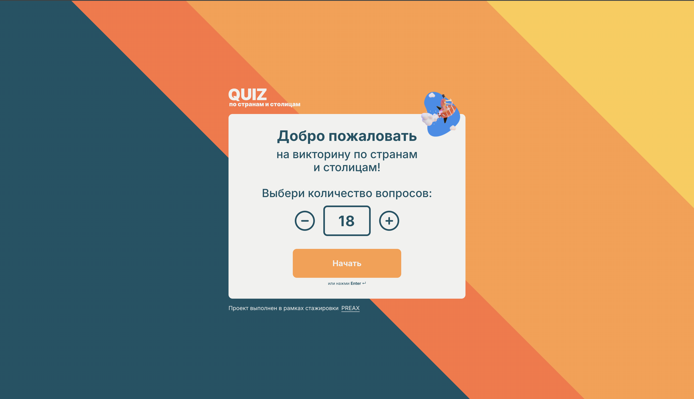
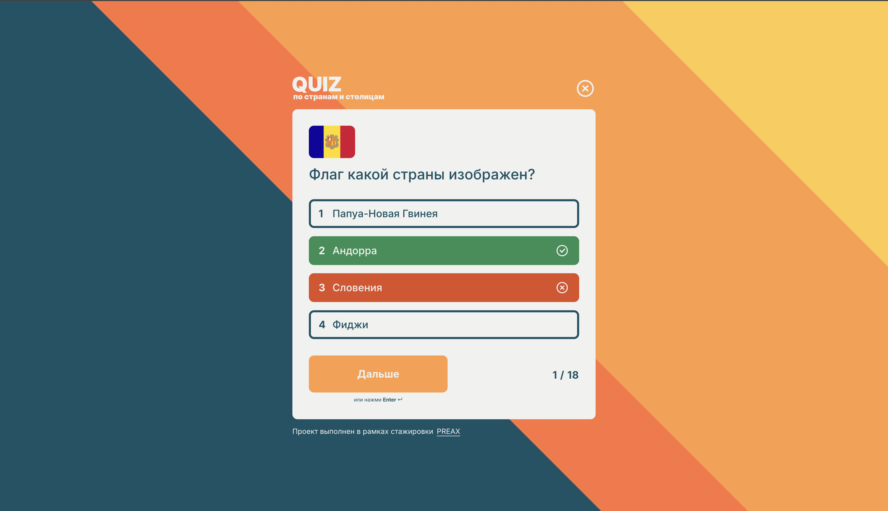
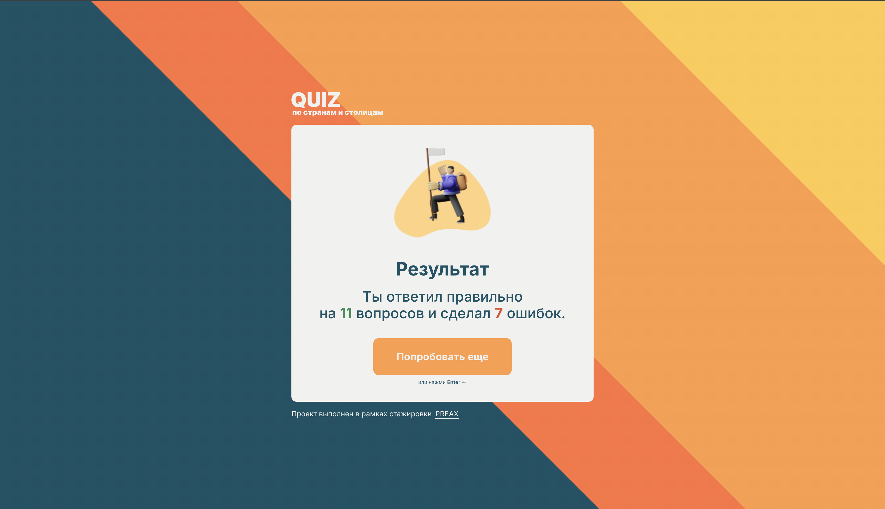

# Preax - QuizApp

Это решение задачи на [спринт QuizApp на Preax](https://preax.ru 'Preax'). Платформа Preax помогает улучшить навыки программирования путем создания реалистичных проектов.

## Оглавление

- [Контакты](#контакты)
- [Установка приложения](#установка-приложения)
- [Мой процесс](#мой-процесс)
  - [Реализован на](#реализован-на)
  - [Чему я научился](#чему-я-научился)
- [Обзор](#обзор)
  - [Заметки](#заметки)
  - [Скриншот](#скриншот)
  - [Задание 1](#задание-1)
  - [Задание 2](#задание-2)
  - [Задание 3](#задание-3)
  - [Задание 4](#задание-4)
  - [Ссылки](#ссылки)

## Контакты

- Name - Marsel
- Nickname preax - marsel-shakirov
- Telegram - @MarselShakirov
- GitHub - [Github](https://github.com/marsel-shakirov)

## Установка приложения

1. открыть терминал
2. установить зависимости командой `npm i`
3. развернуть проект в режиме разработчика `npm run dev`

## Мой процесс

### Реализован на

- [React](https://reactjs.org/) - JS library
- [FSD](https://github.com/feature-sliced) - Feature-Sliced Design (FSD) is an architectural methodology

### Чему я научился

- использовал [useContext](https://react.dev/reference/react/useContext) в связке с [useReducer](https://react.dev/reference/react/useReducer)
- получил начальные знания архитектурной методологии FSD
- использовал хук [useId](https://react.dev/reference/react/useId) для генерации уникальных идентификаторов, которые можно передавать в атрибуты доступности.
- получил знания создания пользовательских хуков
- получил знания реагирования приложения на клавиатуру
- понимание простых генераций случайных индексов в массиве элементов

## Обзор

### Заметки

1. функция unSubscribe (отписка) в utils проверяет уникальность следующих элементов (вопросов и стран), которые не будут повторяться из предыдущего вопроса
2. Картинки в вопросах не имеют фиксированной высоты (90х60) так как некоторые страны не входят в эти размеры (на примере Непал) и будут срезаться.

P.s если есть решение с `object-fit` без срезания скругления или другие способы, то делитесь опытом, заранее благодарю!

### Скриншот

- Desktop
  
  
  

### Задание 1

1. В пустой рабочей папке открыть терминал по адресу папки и ввести команду (обязательно с точкой в конце): npm init vite@latest ..
2. В качестве фреймворка выбрать React и выбрать опцию JavaScript.
3. Установить пакеты: npm install. Запускаем командой: npm run dev.
4. Разделить UI на 4 компонента: Button, Card, Logo, Counter, стили вынести в module.css файлы. Сверстать по макетам в Figma: стартовую страницу, страницы вопроса и результата.
5. При выполнении задачи учитывать:

- Все тексты, изображения и значения взять из макета.
- Контент страницы расположен по центру экрана.
- При высоте окна меньшем чем контентная часть страницы, появляется скролл. При скролле страницы — фоновое изображение не меняет своего положения.
- Минимальная ширина экрана ограничена 1280 px, максимальная не ограничена.

6. Важно: в рамках этого задания только верстка всех экранов, без использования роутинга. Отображаемая страница выводится в зависимости от условия. Функционал будет настроен в следующих задачах.

### Задание 2

1. Использовать для вывода данных json-файл со списком вопросов для квиза (question, correctAnswer, flag).
2. По макету выделить новые компоненты RadioButton, Question, Answer. Компонент Answer состоит из четырех RadioButton, а Question состоит из флага и вопроса.
3. Общее количество вопросов регулируется кнопками «+» и «-». При нажатии к числу в Counter прибавляется или отнимается единица.
4. Минимальное число вопросов — «1». В случае ввода числа меньше минимального — в Counter остается «1».
5. Максимальное количество вопросов должно быть равным количеству вопросов в json-файле. При достижении максимального количества в каунтере кнопка «+» становится неактивной.
6. Ввести число, не соответствующее требованиям по допустимому количеству вопросов, невозможно. Старт квиза по клику на клавишу Enter доступен, только если число вопросов соответствует требованиям по допустимому количеству вопросов. На этапе создания квиза после клика «Начать» (через Enter или кликом) значение в counter нельзя поменять.
7. Высота элемента картинки с флагом должна соответствовать макету, пропорции картинок для разных флагов могут отличаться, важно их не искажать (итоговая ширина может отличаться от макетного варианта).
8. После выбора количества вопросов и нажатия на кнопку «Начать» — сформировать квиз с заданным числом вопросов. После формирования квиза в счетчике прогресса максимальное число равно количеству вопросов в квизе. Функционал счетчика прогресса будет реализован позже.
9. Неправильные варианты ответа для каждого вопроса формируются случайным образом из массива стран. Лимит возможных ответов, включая правильный — 4 варианта.
10. Важно: в текущей задаче реализуем только выбор количества вопросов и формирование первого вопроса квиза, выбор правильного ответа будет настроен далее.

### Задание 3

1. Согласно макету настроить проверку ответа: после выбора варианта и клика на «Ответить» — зеленым подсветить правильный ответ, красным — неправильный. Перезагрузки страницы при этом не происходит. Если пользователь выбирает верный вариант, то подсвечивается только выбранный ответ.
2. Настроить проверку: если название страны — верный ответ, то она больше не попадает в неправильные варианты из массива стран, чтобы ответ не дублировался.
3. Пока не выбран вариант ответа, кнопка «Дальше» в состоянии disabled.
4. После нажатия «Дальше» на странице последнего вопроса квиза — выводятся общие результаты викторины: количество правильных ответов и число ошибок.
5. Кнопка «Попробовать ещё» возвращает пользователя на первую приветственную страницу, а все предыдущие ответы обнуляются.
6. При клике на крестик квиз должен закрываться, и появляться страница старта квиза «Добро пожаловать».

### Задание 4

1. Настроить выбор ответа с помощью клавиатуры: нажатие на клавиши с цифрами (для выбора ответа: «1», «2», «3», «4») и Backspace работают как горячие клавиши на всей странице. Клавиша Backspace отменяет выбор ответа в текущем вопросе. После нажатия на кнопку «Ответить» делать задержку 1,5-2 секунды и на кнопке выводить прелоадер (согласно макету), а затем подсветить результат. 2. Кнопка «Дальше» на время задержки неактивна.
   Для перехода на следующий экран использовать клавишу «Enter».
2. В момент начала анимации проверки ответа нельзя изменять или отменять выбранный вариант ответа.
3. На странице каждого вопроса расположен счетчик, отображающий номер текущего вопроса и общее количество вопросов в квизе. При нажатии на кнопку «Дальше» или клавишу «Enter» — текущий номер вопроса увеличивается на единицу. Вывести прелоадер на главной странице при формировании квиза.

### Ссылки

- Only desktop version
  - Live Site URL **Versel**: [QuizApp](https://fmentor-contact-form.vercel.app 'QuizApp')
